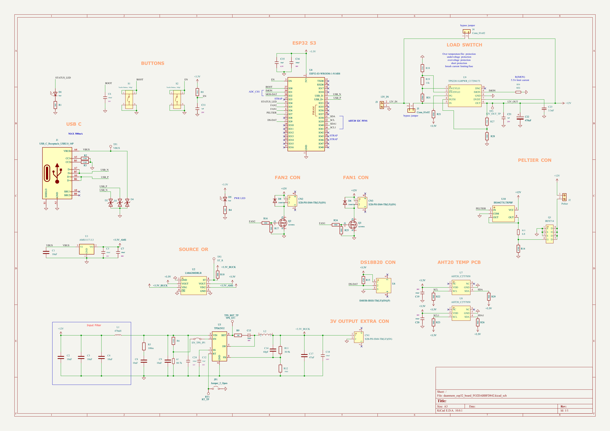
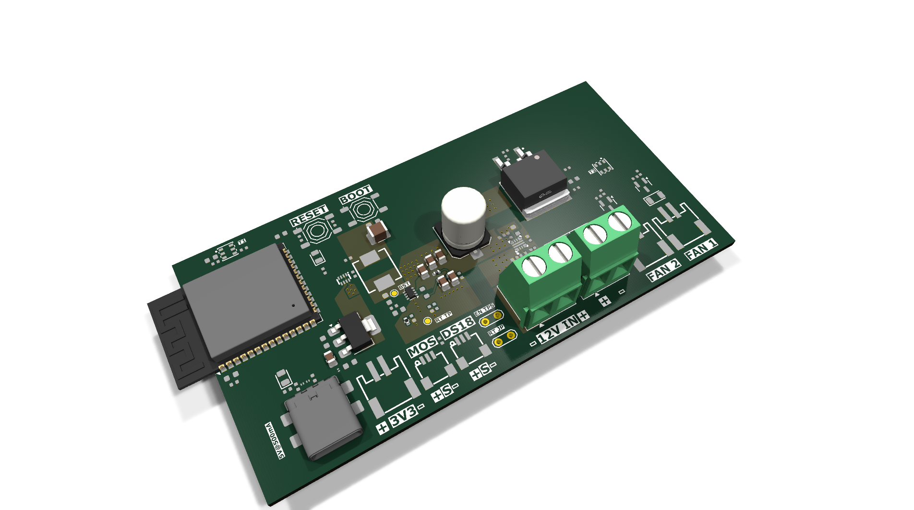
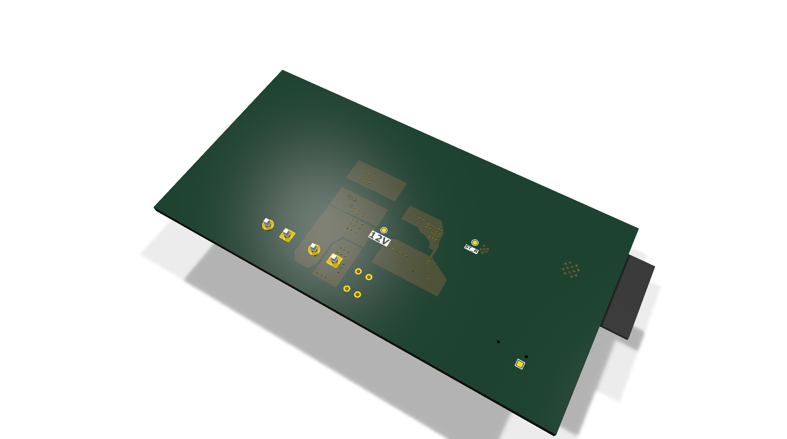

# daanmem_esp32_board_FO2DABBFD842

Smart Peltier driver, ESP32-S3, v1 (v2 in active development)

## At a Glance

- **Status**: Partial / WIP
- **Board size**: 94.01 x 48.1 mm
- **Layers**: 2
- **Components**: 89
- **Key ICs**:
  - U1: AMS1117-3.3
  - U2: LM66200DRLR
  - U3: TPS62932
  - U4: ESP32-S3-WROOM-1-N16R8
  - U6: SM03B-SRSS-TB(LF)(SN)(P)
  - U7,U8: AHT20_C2757850
  - U9: TPS22811LRPWR_C17294173
  - U10: IRS44273LTRPBF

## Schematic

Full PDF: [reports/schematic.pdf](reports/schematic.pdf)

## Component Roles

- **ESP32-S3-WROOM-1** - main MCU; Wi-Fi/BT for remote temperature setpoint + telemetry
- **AMS1117-3.3** - 3.3 V LDO for the MCU core
- **LM66200DRLR** - dual-input ideal-diode / PowerPath controller for clean USB-vs-battery sourcing
- **AO3400A** - 30 V N-channel MOSFETs for switching the Peltier element / fan loads
- **H5VL06B** - small-signal transistors for gate driving / level shifting
- **MCP73831** - single-cell LiPo charger
- **USB-C (16-pin Type-C)** - power + data
- **JST-PH battery connector** (S2B-PH-SM4-TB) for LiPo cell

> v1 reached partial routing (90 footprints placed, 47 tracks, 26 zones). v2 is in active development.

## PCB

**Top copper**

**Bottom copper**

## Bill of Materials

| Refs | Value | Footprint | Qty | MPN | LCSC |
|------|-------|-----------|----:|-----|------|
| C1-C4,C8,C9 | 10uF | Capacitor_SMD:C_0805_2012Metric | 6 |  | [C6119887](https://www.lcsc.com/product-detail/_C6119887.html) |
| C5-C7,C13,C16,C19,C20 | 100nF | PCM_JLCPCB:C_0603 | 7 |  | [C14663](https://www.lcsc.com/product-detail/_C14663.html) |
| C11,C21 | 1uF | PCM_JLCPCB:C_0402 | 2 |  | [C52923](https://www.lcsc.com/product-detail/_C52923.html) |
| C12 | 33nF | PCM_JLCPCB:C_0603 | 1 |  | [C21117](https://www.lcsc.com/product-detail/_C21117.html) |
| C14 | 68pF | PCM_JLCPCB:R_0402 | 1 |  | [C76977](https://www.lcsc.com/product-detail/_C76977.html) |
| C15 | 10uF | PCM_JLCPCB:C_0402 | 1 |  | [C15525](https://www.lcsc.com/product-detail/_C15525.html) |
| C17 | 47uF | Capacitor_SMD:C_1210_3225Metric | 1 |  | [C77101](https://www.lcsc.com/product-detail/_C77101.html) |
| C18 | 100nF | PCM_JLCPCB:C_0805 | 1 |  | [C28233](https://www.lcsc.com/product-detail/_C28233.html) |
| C22 | 470uF | Capacitor_SMD:C_Elec_8x10.2 | 1 |  | [C141429](https://www.lcsc.com/product-detail/_C141429.html) |
| C23 | 3.3nF | PCM_JLCPCB:R_0603 | 1 |  | [C77036](https://www.lcsc.com/product-detail/_C77036.html) |
| C24 | 100nF | PCM_JLCPCB:C_0402 | 1 |  | [C1525](https://www.lcsc.com/product-detail/_C1525.html) |
| CN1-CN3 | S2B-PH-SM4-TB(LF)(SN) | :CONN-SMD_P2.00_S2B-PH-SM4-TB-LF-SN | 3 |  |  |
| D1,D5 | Red | PCM_JLCPCB:D_0805 | 2 |  | [C84256](https://www.lcsc.com/product-detail/_C84256.html) |
| D2-D4 | H5VL06B | PCM_JLCPCB:D_DFN0603-2L | 3 |  | [C7420373](https://www.lcsc.com/product-detail/_C7420373.html) |
| D6,D8 | 1N4007W | PCM_JLCPCB:D_SOD-123FL | 2 |  | [C18199088](https://www.lcsc.com/product-detail/_C18199088.html) |
| EN_TPS_JP1 | Jumper_2_Bridged | TestPoint:TestPoint_2Pads_Pitch2.54mm_Drill0.8mm | 1 |  |  |
| J1 | USB_C_Receptacle_USB2.0_16P | Connector_USB:USB_C_Receptacle_GCT_USB4110 | 1 |  |  |
| J2 | Peltier | TerminalBlock_Phoenix:TerminalBlock_Phoenix_MKDS-1,5-2-5.08_1x02_P5.08mm_Horizontal | 1 |  | [C7509570](https://www.lcsc.com/product-detail/_C7509570.html) |
| J3 | 12V_IN | TerminalBlock_Phoenix:TerminalBlock_Phoenix_MKDS-1,5-2-5.08_1x02_P5.08mm_Horizontal | 1 |  | [C7509570](https://www.lcsc.com/product-detail/_C7509570.html) |
| J4,J5 | Conn_01x02 | Connector_JST:JST_XH_B2B-XH-AM_1x02_P2.50mm_Vertical | 2 |  |  |
| JP1 | Jumper_2_Open | TestPoint:TestPoint_2Pads_Pitch2.54mm_Drill0.8mm | 1 |  |  |
| L1 | 470uH | Inductor_SMD:L_0402_1005Metric | 1 |  | [C5788770](https://www.lcsc.com/product-detail/_C5788770.html) |
| L2 | TMPC0624H-6R8MG-D | inductor_6.8u:IND-SMD_L7.0-W6.6 | 1 |  |  |
| Q1 | IRF8714 | :SOIC-8_L4.9-W3.9-P1.27-LS6.0-BL | 1 |  |  |
| Q2,Q3 | AO3400A | PCM_JLCPCB:Q_SOT-23 | 2 |  | [C20917](https://www.lcsc.com/product-detail/_C20917.html) |
| R1 | 2kΩ | PCM_JLCPCB:R_0402 | 1 |  | [C4109](https://www.lcsc.com/product-detail/_C4109.html) |
| R2,R3 | 5.1kΩ | PCM_JLCPCB:R_0402 | 2 |  | [C25905](https://www.lcsc.com/product-detail/_C25905.html) |
| R4 | 1kΩ | PCM_JLCPCB:R_0402 | 1 |  | [C11702](https://www.lcsc.com/product-detail/_C11702.html) |
| R5 | 100m | PCM_JLCPCB:R_0603 | 1 |  | [C713431](https://www.lcsc.com/product-detail/_C713431.html) |
| R6 | 510kΩ | PCM_JLCPCB:R_0402 | 1 |  | [C11616](https://www.lcsc.com/product-detail/_C11616.html) |
| R7 | 88.7k | PCM_JLCPCB:R_0402 | 1 |  | [C477808](https://www.lcsc.com/product-detail/_C477808.html) |
| R8,R12,R17,R22,R23,R25,R26,R29 | 10kΩ | PCM_JLCPCB:R_0402 | 8 |  | [C25744](https://www.lcsc.com/product-detail/_C25744.html) |
| R9 | 0Ω | PCM_JLCPCB:R_0402 | 1 |  | [C17168](https://www.lcsc.com/product-detail/_C17168.html) |
| R10 | 300Ω | PCM_JLCPCB:R_0402 | 1 |  | [C25102](https://www.lcsc.com/product-detail/_C25102.html) |
| R11 | 30.9k | Resistor_SMD:R_0402_1005Metric | 1 |  | [C2085168](https://www.lcsc.com/product-detail/_C2085168.html) |
| R13 | 6.8 | PCM_JLCPCB:R_0402 | 1 |  |  |
| R14,R15 | 4.7kΩ | PCM_JLCPCB:R_0402 | 2 |  | [C25900](https://www.lcsc.com/product-detail/_C25900.html) |
| R16,R24 | 100Ω | PCM_JLCPCB:R_0402 | 2 |  | [C25076](https://www.lcsc.com/product-detail/_C25076.html) |
| R18,R21,R27 | 47kΩ | PCM_JLCPCB:R_0402 | 3 |  | [C25792](https://www.lcsc.com/product-detail/_C25792.html) |
| R19 | 11k | PCM_JLCPCB:R_0402 | 1 |  | [C705643](https://www.lcsc.com/product-detail/_C705643.html) |
| R28 | 5.6kΩ | PCM_JLCPCB:R_0402 | 1 |  | [C25908](https://www.lcsc.com/product-detail/_C25908.html) |
| R30 | 953 | PCM_JLCPCB:R_0402 | 1 |  | [C852958](https://www.lcsc.com/product-detail/_C852958.html) |
| R31 | 470kΩ | PCM_JLCPCB:R_0402 | 1 |  | [C25790](https://www.lcsc.com/product-detail/_C25790.html) |
| RT1 | RT_TP | TestPoint:TestPoint_Pad_D1.0mm | 1 |  |  |
| S1,S2 | Tactile Button, 160gf | PCM_JLCPCB:SW-SMD_4P-L5.1-W5.1-P3.70-LS6.5-TL-2 | 2 |  | [C318884](https://www.lcsc.com/product-detail/_C318884.html) |
| TP1 | VBUS | TestPoint:TestPoint_Pad_1.0x1.0mm | 1 |  |  |
| TP2 | ST_R | TestPoint:TestPoint_Pad_D1.0mm | 1 |  |  |
| TP3 | 12V_OUT_TP | TestPoint:TestPoint_Pad_D1.0mm | 1 |  |  |
| TPS_ST1 | TPS_BST_TP | TestPoint:TestPoint_Pad_D1.0mm | 1 |  |  |
| U1 | AMS1117-3.3 | Package_TO_SOT_SMD:SOT-223-3_TabPin2 | 1 |  | [C6186](https://www.lcsc.com/product-detail/_C6186.html) |
| U2 | LM66200DRLR | LM66200:SOT-583-8_L2.1-W1.2-P0.50-LS1.6-BL | 1 |  |  |
| U3 | TPS62932 | Package_TO_SOT_SMD:SOT-583-8 | 1 |  | [C3032935](https://www.lcsc.com/product-detail/_C3032935.html) |
| U4 | ESP32-S3-WROOM-1-N16R8 | RF_Module:ESP32-S3-WROOM-1 | 1 |  | [C2913202](https://www.lcsc.com/product-detail/_C2913202.html) |
| U6 | SM03B-SRSS-TB(LF)(SN)(P) | :CONN-SMD_SM03B-SRSS-TB-LF-SN-P | 1 |  |  |
| U7,U8 | AHT20_C2757850 | aht20:SENSOR-SMD_L3.0-W3.0-P1.00-BR | 2 |  |  |
| U9 | TPS22811LRPWR_C17294173 | tps22811:VQFN-10_L2.0-W2.0-P0.45-TL | 1 |  |  |
| U10 | IRS44273LTRPBF | :SOT-23-5_L3.0-W1.7-P0.95-LS2.8-BR | 1 |  |  |

_18 of 57 line items don't have an LCSC code in the schematic - search [LCSC](https://www.lcsc.com/) or [JLC parts search](https://jlcsearch.tscircuit.com/) by MPN or footprint when sourcing._

## Files

- `daanmem_esp32_board_FO2DABBFD842.kicad_pro` - KiCad project
- `daanmem_esp32_board_FO2DABBFD842.kicad_sch` - schematic source
- `daanmem_esp32_board_FO2DABBFD842.kicad_pcb` - PCB layout source
- `reports/schematic.pdf` - full schematic (printable)
- `reports/bom.csv` - bill of materials
- `reports/pcb-top.svg`, `reports/pcb-bottom.svg` - copper artwork
- `reports/board-stats.json` - KiCad-generated board statistics

---

_Renders and metadata auto-generated by `Backup-KiCadProject.ps1` using KiCad 10.0._

